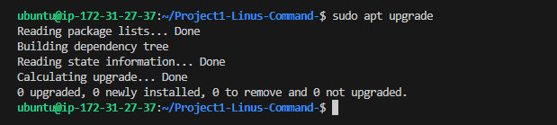
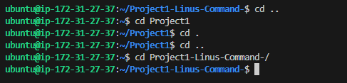
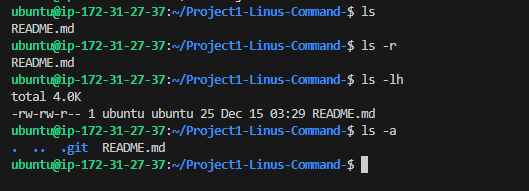
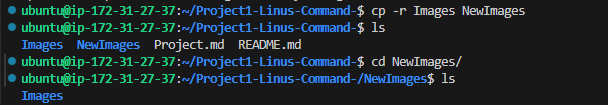
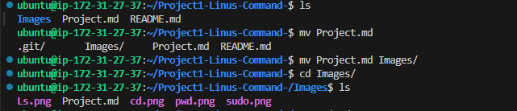

# Documentation For LINUS COMMAND IMPLEMENTATION

## This Project shows how to implement linus Command

## 1. **sudo command**
Sudo is a command-line utility for Unix and Unix-based operating systems such as Linux and macOS. The utility provides an efficient way to temporarily grant users or user groups privileged access to system resources so that they can run commands that they cannot run under their regular accounts.

Here is the general syntax;

`sudo (command e.g apt upgrade)`

so it becomes 

`sudo apt upgrade`

## 2. **pwd command**
The "pwd" command prints the full name (the full path) of current/working directory. By default, right after ssh-ing to a Linux machine you would find yourself in your home directory, usually /home/<username>. ssh to a cluster, type “pwd” and see if it returns '/home/<ISUNetID>', where <ISUNetID> is your ISU NetID.

The pwd command uses the following syntax;

`pwd [option]`

it has the following options;

-L (logical)	Use PWD from environment, even if it contains symbolic links

-P (physical)	Avoid all symbolic links

–help	Display this help and exit

–version	Output version information and exit

`pwd`

## 3. ** command**
cd: The cd command will allow you to change directories. When you open a terminal you will be in your home directory. To move around the file system you will use cd. Examples:

    To navigate into the root directory, use "cd /"

    To navigate to your home directory, use "cd" or "cd ~"

    To navigate up one directory level, use "cd .."

    To navigate to the previous directory (or back), use "cd -"

    To navigate through multiple levels of directory at once, specify the full directory path that you want to go to. For example, use, "cd /var/www" to go directly to the /www subdirectory of /var/. As another example, "cd ~/Desktop" will move you to the Desktop subdirectory inside your home directory. 

## 4. **LS command**
ls: The ls command will show you ('list') the files in your current directory. Used with certain options, you can see sizes of files, when files were made, and permissions of files. Example: "ls ~" will show you the files that are in your home directory. 

ls has the following options;

ls -r	It is used to print the list in reverse order.

ls -R	It will display the content of the sub-directories also.

ls -lX	It will group the files with same extensions together in the list.

ls -lt	It will sort the list by displaying recently modified filed at top.

## 5. **CAT command**

The cat command on Linux concatenates files together. It's often used to concatenate one file to nothing to print the single file's contents to the terminal. This is a quick way to preview the contents of a text file without having to open the file in a large application.

Here is the general syntax;

`cat Project.md`

## 6. **cp command**

cp: The cp command will make a copy of a file for you. Example: "cp file foo" will make an exact copy of "file" and name it "foo", but the file "file" will still be there. If you are copying a directory, you must use "cp -r directory foo" (copy recursively). (To understand what "recursively" means, think of it this way: to copy the directory and all its files and subdirectories and all their files and subdirectories of the subdirectories and all their files, and on and on, "recursively") 

for example; `cp -r Images NewImages`

## 7. **mv command**

mv: The mv command will move a file to a different location or will rename a file. Examples are as follows: "mv file foo" will rename the file "file" to "foo". "mv foo ~/Desktop" will move the file "foo" to your Desktop directory, but it will not rename it. You must specify a new file name to rename a file.

    To save on typing, you can substitute '~' in place of the home directory.

    Note that if you are using mv with sudo you can use the ~ shortcut, because the terminal expands the ~ to your home directory. However, when you open a root shell with sudo -i or sudo -s, ~ will refer to the root account's home directory, not your own. 

for example; `mv Project.md Images`

