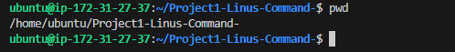
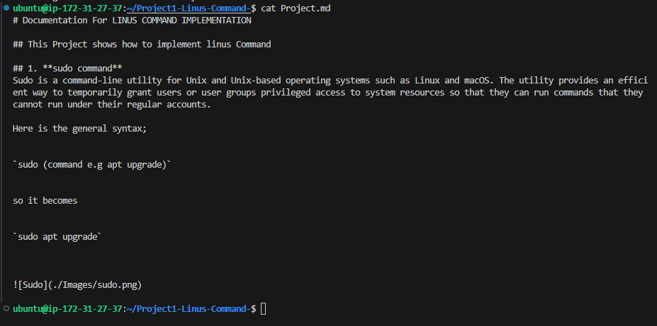

# Documentation For LINUS COMMAND IMPLEMENTATION

## This Project shows how to implement linus Commands

## 1. **sudo command**
Sudo is a command-line utility for Unix and Unix-based operating systems such as Linux and macOS. The utility provides an efficient way to temporarily grant users or user groups privileged access to system resources so that they can run commands that they cannot run under their regular accounts.

Here is the general syntax;

`sudo (command e.g apt upgrade)`

so it becomes 

`sudo apt upgrade`

## 2. **pwd command**
The "pwd" command prints the full name (the full path) of current/working directory. By default, right after ssh-ing to a Linux machine you would find yourself in your home directory, usually /home/<username>. ssh to a cluster, type “pwd” and see if it returns '/home/<ISUNetID>', where <ISUNetID> is your ISU NetID.

The pwd command uses the following syntax;

`pwd [option]`

it has the following options;

-L (logical)	Use PWD from environment, even if it contains symbolic links

-P (physical)	Avoid all symbolic links

–help	Display this help and exit

–version	Output version information and exit

`pwd`

## 3. ** command**
cd: The cd command will allow you to change directories. When you open a terminal you will be in your home directory. To move around the file system you will use cd. Examples:

    To navigate into the root directory, use "cd /"

    To navigate to your home directory, use "cd" or "cd ~"

    To navigate up one directory level, use "cd .."

    To navigate to the previous directory (or back), use "cd -"

    To navigate through multiple levels of directory at once, specify the full directory path that you want to go to. For example, use, "cd /var/www" to go directly to the /www subdirectory of /var/. As another example, "cd ~/Desktop" will move you to the Desktop subdirectory inside your home directory. 

## 4. **LS command**
ls: The ls command will show you ('list') the files in your current directory. Used with certain options, you can see sizes of files, when files were made, and permissions of files. Example: "ls ~" will show you the files that are in your home directory. 

ls has the following options;

ls -r	It is used to print the list in reverse order.

ls -R	It will display the content of the sub-directories also.

ls -lX	It will group the files with same extensions together in the list.

ls -lt	It will sort the list by displaying recently modified filed at top.

## 5. **CAT command**

The cat command on Linux concatenates files together. It's often used to concatenate one file to nothing to print the single file's contents to the terminal. This is a quick way to preview the contents of a text file without having to open the file in a large application.

Here is the general syntax;

`cat Project.md`

## 6. **cp command**

cp: The cp command will make a copy of a file for you. Example: "cp file foo" will make an exact copy of "file" and name it "foo", but the file "file" will still be there. If you are copying a directory, you must use "cp -r directory foo" (copy recursively). (To understand what "recursively" means, think of it this way: to copy the directory and all its files and subdirectories and all their files and subdirectories of the subdirectories and all their files, and on and on, "recursively") 

for example; `cp -r Images NewImages`

## 7. **mv command**

mv: The mv command will move a file to a different location or will rename a file. Examples are as follows: "mv file foo" will rename the file "file" to "foo". "mv foo ~/Desktop" will move the file "foo" to your Desktop directory, but it will not rename it. You must specify a new file name to rename a file.

    To save on typing, you can substitute '~' in place of the home directory.

    Note that if you are using mv with sudo you can use the ~ shortcut, because the terminal expands the ~ to your home directory. However, when you open a root shell with sudo -i or sudo -s, ~ will refer to the root account's home directory, not your own. 

for example; `mv Project.md Images`

## 8. **mkdir command**

The mkdir command in Linux/Unix is a command-line utility that allows users to create new directories. mkdir stands for "make directory." With mkdir , you can also set permissions, create multiple directories at once, and much more.

Here's the basic syntax

`mkdir [option] directory_name`

## 9. **rmdir command**

The rmdir command removes the directory, specified by the Directory parameter, from the system. The directory must be empty before you can remove it, and you must have write permission in its parent directory. Use the ls -al command to check whether the directory is empty.

## 10. **rm command**

The rm command removes the entries for a specified file, group of files, or certain select files from a list within a directory. User confirmation, read permission, and write permission are not required before a file is removed when you use the rm command.

Here's the general syntax;

`rm filename`

## 11. **touch command**

The touch command is used in Linux to change timestamps and access stamps in individual files or directories. Since this recreates a file if it doesn't already exist, the command is also often used to create new, empty files. For most users, this secondary use is far more important in their daily work.

## 12. **locate command**

The 'locate' command in Linux is a powerful tool used to find files by their name. You can use it like this: locate [options] filename. txt . In this example, we use the 'locate' command to search for 'example.

## 13. **find command**

To find a file in Linux, you can use the Linux find command. This starts a recursive search, where a directory hierarchy is searched following certain criteria. The Linux find command is a precise tool for finding files and directories and is supported across pretty much all Linux distributions.

Here's the general syntax;

`find [option] [path][expression]`

You can edit to suit your case.
For example; you want to look for a file called Project.md in the home directory.

## 14. **grep command**

Grep is a useful command to search for matching patterns in a file. grep is short for "global regular expression print". If you are a system admin who needs to scrape through log files or a developer trying to find certain occurrences in the code file, then grep is a powerful command to use.

## 15. **df command**
The df command displays information about total space and available space on a file system. The FileSystem parameter specifies the name of the device on which the file system resides, the directory on which the file system is mounted, or the relative path name of a file system.

these are of the command options for df command;
-t type	Limit listing to file systems of type TYPE
-a	Show all filesystems
-i	Get info about Inodes
-B SIZE	Set blocksize. You can also use the BLOCKSIZE environment variables. For example, BLOCKSIZE=512 df

## 16. **du command**

The du (disk usage) command measures the disk space occupied by files or directories. By default, it measures the current directory and all its subdirectories, printing totals in blocks for each, with a grand total at the bottom.

Adding a flat to the du command will modify the operation, such as;

-b -k -m	Measure usage in bytes ( -b ), kilobytes ( -k ), or megabytes ( -m ).
-c	Print a total in the last line. This is the default behavior when measuring a directory, but for measuring individual files, provide -c if you want a total.
-L	Following symbolic links and measure the files they point to.

## 17. **head command**

The Linux head command prints the first lines of one or more files (or piped data) to standard output. By default, it shows the first 10 lines. However, head provides several arguments you can use to modify the output. Read on to learn how to use the head command, its syntax, and options with easy-to-follow examples.

## 18. **tail command**

The Linux tail command is a command-line utility that prints data from the end of a specified file or files to standard output. The utility provides an easy way to quickly see file updates in real time, as new data is usually added to the end of a file.

## 19. **diff command**

diff is a command-line utility that allows you to compare two files line by line. It can also compare the contents of directories. The diff command is most commonly used to create a patch containing the differences between one or more files that can be applied using the patch command.

Here's the general format;

`dif [option] file1 file2`

## 20. **tar command**

The Linux tar command is used for saving several files into an archive file. We can later extract all of the files or just the desired ones in the archive file. tar stands for “tape archive”. tar, by default, keeps the directory structure of archived files.

Here is the basic syntax;

`tar [options][archive_file][file or directory to be archived]`

For instance, you want to create a new TAR arrchive named newimage.tar in the home directory: you can edit the code to suit your purpose.

## File Permissions And Ownership

21. **chmod command**

The chmod, or change mode, command allows an administrator to set or modify a file's permissions. Every UNIX/Linux file has an owner user and an owner group attached to it, and every file has permissions associated with it. The permissions are as follows: read, write, or execute.

Here's the basic syntax;

`chmod [option][permission][file_name]`

22. **Chown command**

The chown command changes the owner of the file or directory specified by the File or Directory parameter to the user specified by the Owner parameter. The value of the Owner parameter can be a user name from the user database or a numeric user ID. Optionally, a group can also be specified.

`chown [option] owner[:group] file(s)`

for example, you want to make Linuxuser2 the owner of filename.txt;

`chown linuxuser2 filename.txt`

23. **job command**

The jobs command reports the status of background processes that are currently running, based on the job identifier; it also reports on the status of stopped processes and completed processes. If you use the -l option, you can display both the job identifier and the PID for the process.

Here's the basis syntax;

`jobs [options] jobID`

it has the following options;

    -l - list PIDs in addition to default info.
    -n - list only processes that have changed since the last notification.
    -p - list PIDs only.
    -r - show only running jobs.
    -s - show only stopped jobs.

24. **kill command**

The kill command sends a signal to a process. This can terminate a process (the default), interrupt it, suspend it, crash it, and so on. You must own the process, or be the superuser, to affect it.

To find the process identification number(PID), use the code below;

`ps ux`

After finding the signal to use and the programs PID, enter the following syntax;

`kill [signal_option] pid`

The kill command is used to send a signal to processes. The most frequently-used signal is SIGKILL or -9 , which terminates the given processes.

25. **ping command**

Ping is short for Packet Internet Groper. This command is mainly used for checking the network connectivity among host/server and host. The ping command takes the URL or IP address as input and transfers the data packet to a specified address along with a "PING" message. Then, it will get a reply from the host/server. This time is known as "latency".

Here's the general syntax;

`ping [option] [hostname_or_IP_address]`

For example, you want to know if you can connnect to facebook and measure it's response time:

`ping facebook.com`

26. **wget command**

You can use the wget command to download a file from the internet. Files are automatically saved in your current work folder. The download won't take place interactively. This means that processes can be carried out even when you're not logged in.

To use it, enter the following syntax;

`wget [option] [url]`

27. **uname command**

The uname command writes to standard output the name of the operating system that you are using. The machine ID number contains 12 characters in the following digit format: xxyyyyyymmss. The xx positions indicate the system and is always 00. The yyyyyy positions contain the unique ID number for the entire system.

Here is basic syntax:

`uname [option]`

28. **top command**

The top (table of processes) command shows a real-time view of running processes in Linux and displays kernel-managed tasks. The command also provides a system information summary that shows resource utilization, including CPU and memory usage. In this tutorial, you will learn to use the top command in Linux.

To run the command, simply type top into the CLI;

`top`

29. **history command**

Linux history command is used to display the history of the commands executed by the user. It is a handy tool for auditing the executed commands along with their date and time.

`history [option]`

Here are options for it;

    -c: It is used to clear the complete history list.
    -d offset: It is used to delete the history entry at the position OFFSET.
    -a: It is used to append history lines.
    -n: It is used to read all history lines.
    -r: It is used to read the history file.

30. **man command**

man command in Linux is used to display the user manual of any command that we can run on the terminal. It provides a detailed view of the command which includes NAME, SYNOPSIS, DESCRIPTION, OPTIONS, EXIT STATUS, RETURN VALUES, ERRORS, FILES, VERSIONS, EXAMPLES, AUTHORS and SEE ALSO.

to execute this command, enter;

`man [command_name]`

For example;

`man ls`

enter this command if you want to display a specific section 

`man [option] [section_number] [command_name]`

for instance, you want to see section 2 of ls command manual;

`man 2 ls`

31. **echo command**

Echo is a Unix/Linux command tool used for displaying lines of text or string which are passed as arguments on the command line. This is one of the basic command in linux and most commonly used in shell scripts.

Here's the basic syntax;

`echo [option] [string]`

this command supports many options such as;

    Use n to Omit Trailing Newlines.
    Use -e to Add Various Escape Characters. Use \a for Alert. Use \b for Backspace. Use \c to Trim Output. Use \f for Form Feed. Use \n To Add Newline. Use \t for Horizontal Tab Space. Use \v for Vertical Tab Space. ...
    Use -E to Ignore Escape Characters.

32. **zip/unzip command**

ZIP is a compression and file packaging utility for Unix. Each file is stored in a single .zip {.zip-filename} file with the extension .zip. The zip command is also useful for archiving files and directories and reducing disc usage.

To use it, enter the following syntax;

`zip [options] zipfile file1 file2….`

The syntax for Creating a zip file:

`zip [file_name.zip] [file_name]`

here are the command options;

-u	Update: only changed or new files.	zip -u archive.zip
-d	Delete entries from a zip file.	zip -d archive.zip file1.txt
-j	Junk paths: store just the name of a saved file.	zip -j archive.zip dir1/file1.txt
-v	Verbose mode.	zip -v archive.zip file1.txt

unzip will list, test, or extract files from a ZIP archive, commonly found on Unix systems. The default behavior (with no options) is to extract into the current directory (and sub-directories below it) all files from the specified ZIP archive.

Syntax:

`unzip [file_name.zip]` 

Suppose we have a zip file “name = jayesh_gfg.zip” and we have three text files inside it “name = a.txt, b.txt and c.txt”. we have to unzip it in the current directory.
 

Syntax and Output:

`unzip jayesh_gfg.zip`

33. **hostname command**

The hostname command sets or displays the name of the current host system. Note: If the cluster is present on the machine, you cannot change the host name. You can execute it without an option;

`hostname [option]`

Here are some few options flag to use;

    -a , --alias : Displays the alias name of the host.
    -A , --all-fqdns : Displays every FQDN (Fully Qualified Domain Name) of the computer.
    -b , --boot : Always set a hostname.
    -d , --domain : Display DNS domain name.

34. **useradd, userdel commands**

useradd is a Linux command for creating a new user. It requires various options to add and set up an active user account. Additionally, the command allows changing default values for the user creation process. useradd is a low-level, portable command available on all Linux distributions.

The general syntax for the useradd command is as follows:

`useradd [OPTIONS] USERNAME`

For instance, to create a new user named jane, you would run the following:

`sudo useradd jane`

The command adds an entry to the /etc/passwd, /etc/shadow, /etc/group, and /etc/gshadow files.

To be able to log in as the newly created user, you need to set the user password. You can do that by running the passwd command followed by the username:

`sudo passwd jane`

The command will prompt you to enter and confirm the password. Make sure you use a strong password

Changing password for user jane.

New password:

Retype new password:

passwd: all authentication tokens updated successfully.

To delete User, use the syntax below;

`userdel username`

35. **apt_get command**

apt-get is a command line tool for interacting with the Advanced Package Tool (APT) library (a package management system for Linux distributions). It allows you to search for, install, manage, update, and remove software. The tool does not build software from the source code.

Running the apt-get command requires you to use the sudo or root privilages;

Here's the general syntax;

`apt-get [options] (command)`

36. nano, vi, jed commands:

GNU nano, vi, jed is a friendly and convenient text editor like vi and emac. It offers many other extra features like word searching, replacing, jump to a line or column, filename tab completion, auto-indentation, etc.

To use it, enter the following keywords;

`nano [filename]`

vi uses the following modes to work

    Command mode: in this mode, you can open or create files, specify cursor position and editing command, save or quit your work . Press Esc key to return to Command mode.
    Entry mode. ...
    Last-Line mode: when in Command mode, type a : to go into the Last-Line mode.

To use vi on a file, type the following;

`vi [filename]`

37. **alias, unalias command**

The alias command lets you create shortcuts for long commands, making them easier to remember and use. It will have the same functionality as if the whole command is run.

To use the alias command, enter this syntax;

`alias Name=String`

For example you want to make 'K' the alias of the kill command;

`alias k=’kill’`

On the other hand, the unalias command deletes the existing alias. 

Here's what the general syntax looks like;

`unalias [alias_name]`

38. **su command**

The su command is used to switch to another user, in other words change user ID during a normal login session (that is why it is sometimes referred to as switch (-) user by a number of Linux users). If executed without a username, for example su - , it will login as root user by default. Su allows users to switch to the root account and perform administrative tasks, while sudo allows users to execute specific commands with elevated privileges. Sudo is more secure than su since it offers more granular control over user permissions.

Here is the general syntax;

`su [options] [username [argument]]`

Here are the acceptable options of this command;

    Username – Replace username with the actual username you want to log in with. ...
    –c or –command [command] – Runs a specific command as the specified user.
    – or –l or –login [username] – Runs a login script to change to a specific username.

39. **htop commmand**

In a nutshell, htop is a useful command-line tool in the Linux environment to determine the cause of load by each process. It is similar to Task Manager in the Windows OS environment. It can be used to troubleshoot and kill a process that is utilizing excessive server resources.

To use it, run the following command;

`htop [options]`

You can also add options like;  
-d –delay : Used to show the delay between updates, in tenths of seconds.
-C –no-color –no-colour : Start htop in monochrome mode.
-h –help : Used to display the help message and exit.
-u –user=USERNAME : Used to show only the processes of a given user.

40. **ps command**

The ps command writes the status of active processes and if the -m flag is given, displays the associated kernel threads to standard output. While the -m flag displays threads associated with processes using extra lines, you must use the -o flag with the THREAD field specifier to display extra thread-related columns.

it has the following command options;

    ps -ef or ps -aux − List currently running processes in full format

    ps -ax − List currently running processes

    ps -u <username> − List processes for a specific user

    ps -C <command> − List processes for a given command

    ps -p <PID> − List processes with a given PID

    ps -ppid <PPID> − List processes with a given parent process ID (PPID)

    pstree − Show processes in a hierarchy

    ps -L − List all threads for a particular process

    ps --sort pmem − Find memory leaks

    ps -eo − Show security information

    ps -U root -u root u − Show processes running by root
